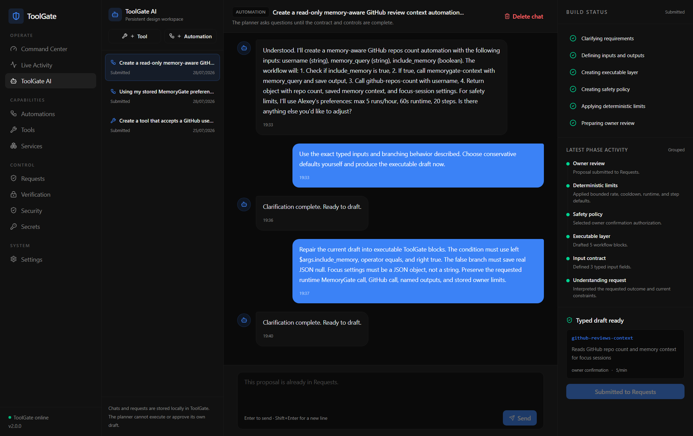
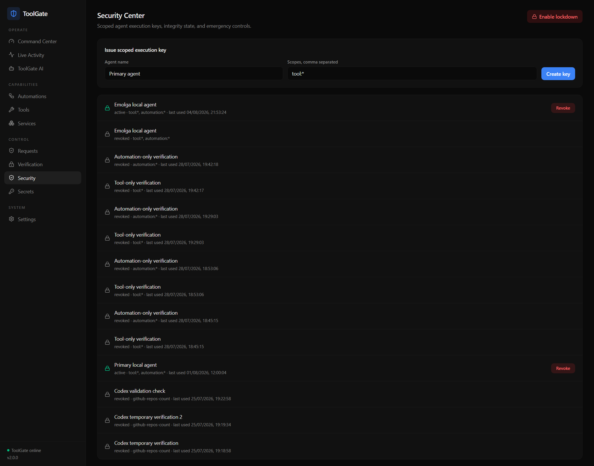
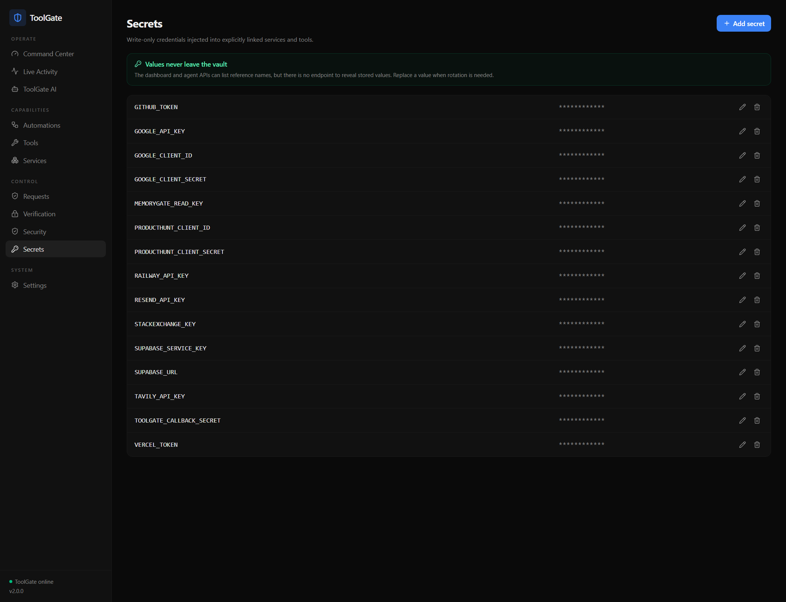

# ToolGate

ToolGate is a local, single-owner control plane for AI agent capabilities. It keeps provider credentials outside the agent, exposes only typed capabilities, enforces deterministic policy before execution, and records a redacted audit trail for every important decision.

The project is designed for one owner and one primary local agent. ToolGate is the only capability boundary the agent needs: providers, local services, MemoryGate, approvals, and emergency controls remain behind it.

## Control Plane

| Object | Purpose |
| --- | --- |
| **Service** | Provider identity, write-only secret references, destination policy, health, and linked capabilities. |
| **Tool** | One atomic typed operation using a restricted executor. Tools cannot orchestrate other tools. |
| **Automation** | A versioned deterministic workflow composed from tools and bounded control blocks. |
| **Request** | Owner-reviewable verification, warning, proposal, update, or historical decision. |

The dashboard includes a command center, live execution and AI activity, services, tool and automation editors, persistent ToolGate AI design sessions, requests, verification adapters, security controls, secrets, and settings.

## What Is In This Repository

- `toolgate/api/`: FastAPI owner and agent API, restricted executors, automation runtime, verification callbacks, built-in research tool sync, and ToolGate AI planning endpoints.
- `toolgate/core/`: SQLite control-plane storage, policy helpers, vault integration, planner helpers, research adapters, and runtime paths.
- `toolgate/cli/`: standard-library agent CLI for scoped execution keys.
- `toolgate/mcp/`: single-operator stdio MCP console bridge. It has no execution key and no scope check; it is for the owner's own machine, never for an agent.
- `dashboard/`: React and Vite owner dashboard for services, tools, automations, requests, secrets, security controls, and ToolGate AI sessions.
- `integrations/mcp/`: example MCP client configuration for the single-operator console bridge.
- `docs/`: integration notes and dashboard screenshots.
- `toolgate/tests/`: deterministic tests for the control plane, security model, workflow engine, research adapters, and MCP adapter.
- `toolgate/scripts/`: live verification utilities for a running local stack.

## Dashboard Screenshots

| Command Center | ToolGate AI |
| --- | --- |
|  |  |

| Security Center | Secrets |
| --- | --- |
|  |  |

## Security Model

- Agents authenticate with rotatable execution keys and explicit `tool:*`, `tool:<id>`, `automation:*`, or `automation:<id>` scopes.
- Management endpoints require the separate admin key. Agent keys cannot manage services, secrets, policies, verification methods, or requests.
- Vault values are write-only **and encrypted at rest**. ToolGate lists reference names, no API reveals a value, and the stored value is a Fernet token whose key is derived from an install-time secret held outside the values file.
- `/health` runs real dependency probes. It reports `degraded` and names the failing dependency instead of returning a hardcoded `ok`.
- Inputs are validated deterministically by type, range, length, pattern, and allowed values before execution.
- Rate, cooldown, runtime, workflow-step, destination, response-size, loop, retry, and delay ceilings are enforced in code.
- Sensitive actions bind approval to the exact object type, object ID, version, argument digest, nonce, and expiry.
- An approval is atomically consumed once. Replays and changed arguments fail closed.
- Signed verification callbacks use HMAC-SHA256, a 60-second timestamp window, a per-request nonce, and immutable action binding.
- Lockdown blocks agent execution, new agent requests, planner work, verification callbacks, and ToolGate-mediated MemoryGate access.
- Logs and API responses contain references and redacted outcomes, never injected secret values.
- Browser access is restricted to configured local dashboard origins.

The stdio MCP bridge is the one deliberate exception to the identity and scope rules above: it authenticates nobody and scopes nothing. It exists for a single trusted operator on the owner's own machine. Never attach an autonomous agent to it -- see [`docs/SINGLE_OPERATOR_MCP_BRIDGE.md`](docs/SINGLE_OPERATOR_MCP_BRIDGE.md).

ToolGate reduces agent and prompt-injection risk, but it cannot protect a host that is already fully compromised. Keep the API private, protect the admin key, and use OS/container isolation as the outer security boundary.

## Bounded Web Research

Research tools accept typed queries and fixed source names, not arbitrary URLs. Search results become short-lived server-issued handles; the fetch tool resolves only those handles, revalidates every HTTPS redirect and public destination, restricts content types, and stops while streaming once 512 KiB of decompressed content is reached.

HTML is reduced before model use: scripts, styles, SVG, hidden elements, navigation, forms, page chrome, cookie prompts, subscription prompts, and repeated lines are removed. Unicode control characters are normalized, search-provider markup is stripped, long encoded blobs and instruction/exfiltration patterns are blocked, and surviving text is enclosed in an explicit untrusted-content boundary. These controls reduce both tokens and attack surface, but retrieved content must still be treated as hostile evidence rather than instructions.

Product Hunt can be used as an optional read-only competition provider. Because Product Hunt requires separate permission for commercial API use, ToolGate keeps it disabled until the owner confirms that approval in Settings and stores `PRODUCTHUNT_TOKEN` through Secrets. The token remains in ToolGate; the caller receives only locally filtered, redacted product metadata. SearXNG remains the automatic fallback.

Business research is exposed as small reusable tools instead of one monolithic
search action. Atomic tools cover broad web search, Reddit, Hacker News, GitHub
issues, Stack Overflow, YouTube comments, and Product Hunt. Bounded composition
tools combine them into pain, developer, and competition scans while preserving
the source report and failures from every provider.

`TAVILY_API_KEY` powers broad discovery, `GOOGLE_API_KEY` powers bounded YouTube
video and public-comment retrieval, `GITHUB_TOKEN` raises GitHub search limits,
and `STACKEXCHANGE_KEY` raises Stack Overflow limits. Reddit uses its public
read-only JSON search endpoint. Source APIs fall back first to domain-scoped
Tavily and then local SearXNG when direct access is unavailable. Product Hunt
remains permission-gated and uses the same bounded fallback chain. Every result
is normalized, HTML-stripped, injection-scanned,
deduplicated, and represented by a short-lived provenance handle. Invalid or
missing optional credentials fail closed or fall back without exposing values.

## Restricted Executors

Tool definitions can use these first-class executors:

- `echo`: returns validated arguments for local deterministic capabilities and testing.
- `local_echo`: returns a digest and length only, for proving the approval path without touching the network or the filesystem.
- `http_json`: bounded GET or owner-confirmed POST requests to exact public HTTPS hosts; redirects and private destinations are denied.
- `memorygate`: fixed-host, read-only `context` or `ask` operations using a vault-held MemoryGate credential.
- `ollama_generate`: bounded generation through the internal Ollama service with declared prompt inputs and no secret access.
- `gemini_generate`: bounded generation through an allowlisted hosted Gemini model, with the key injected as a header from the vault.
- `research_search`: one bounded provider search returning short-lived provenance handles.
- `research_bundle`: a reusable multi-source research profile that preserves per-source reports and failures.
- `research_fetch`: resolves exactly one server-issued research handle. It does not accept URLs.
- `research_fetch_batch`: resolves up to eight handles as one bounded, scanned batch.

Arbitrary agent-supplied Python and legacy script execution are intentionally unsupported.

## Automation Engine

Automations use a typed JSON workflow as their source of truth. The dashboard presents the same definition as a roadmap, layer map, draggable block editor, and editable code view.

Supported blocks are `tool_call`, `set`, `calculation`, `condition`, `switch`, bounded `loop`, bounded `retry`, `delay`, `notification`, and `return`. Expressions may reference `$args.<name>`, `$vars.<name>`, and `$last.<path>`. A tool's declared output is available as `$last.result.<output-name>` and its raw value remains available as `$last.result.result`. Nested depth, total steps, runtime, loop iterations, retry attempts, and delay duration are all capped.

## Agent CLI

The CLI reads its execution credential from `~/.config/toolgate/credentials.env` by default:

```dotenv
TOOLGATE_URL=http://127.0.0.1:8010
TOOLGATE_EXECUTION_KEY=tgx_replace_with_scoped_key
```

The CLI uses only the Python standard library, so agents do not need to install ToolGate's API dependencies. It reads only the scoped credentials file and never loads the owner vault file.

Core commands:

```text
toolgate status
toolgate tool list
toolgate tool <name> info
toolgate tool <name> --argument value
toolgate automation list
toolgate automation <name> info
toolgate automation <name> run --argument value
toolgate request create-tool "Describe the capability needed"
toolgate request status <id>
toolgate update
toolgate watch
```

Add `--json` to any command for a stable machine-readable contract. Values such as integers, arrays, objects, booleans, and `null` are coerced from JSON. Confirmation responses include a `request_id` and exact retry command using `--approval-request-id`.

## Single-Operator MCP Console Bridge

ToolGate ships a stdio MCP bridge at `toolgate/mcp/toolgate_mcp.py`. It is a
convenience for **one trusted human on the machine that holds ToolGate's state**,
so that the owner can drive their own ToolGate from an MCP client without
minting a key.

**It bypasses identity and scope.** It reads no execution key, never calls
`is_scoped`, exposes every tool with `status: active`, and attributes every call
to one hardcoded actor. **Never attach an autonomous agent to it.** Agents use
the keyed HTTP API with a scoped execution key, which authenticates the caller,
filters the catalogue by scope and binds each approval to the key that asked for
it.

Everything below the identity layer still applies over the bridge: lockdown,
input validation, `authorization: blocked`, the approval binding, usage limits,
the restricted executors, output validation and audit events. It is a hole in
*who is asking*, not in policy.

Example config:

```json
{
  "mcpServers": {
    "toolgate": {
      "command": "python",
      "args": ["toolgate/mcp/toolgate_mcp.py"],
      "env": {
        "TOOLGATE_MCP_ACTOR": "Operator console",
        "TOOLGATE_MCP_PRESERVE_IDS": "0"
      }
    }
  }
}
```

Set `TOOLGATE_MCP_PRESERVE_IDS=1` only if the MCP client accepts dotted tool
names such as `research.search`. Read
[`docs/SINGLE_OPERATOR_MCP_BRIDGE.md`](docs/SINGLE_OPERATOR_MCP_BRIDGE.md)
before using it; the example config is at
`integrations/mcp/toolgate.single-operator.mcp.json`.

## Local Deployment

1. Create the local environment file:

```powershell
Copy-Item toolgate\.env.example toolgate\.env
```

2. Create the shared Docker network the compose file joins, if it does not exist yet:

```powershell
docker network create conker_net
```

3. Start the API, dashboard and SearXNG. The compose file lives in `toolgate/` and its build context is the repository root, so run it from there:

```powershell
Set-Location toolgate
docker compose up -d --build
```

4. Open `http://localhost:8011`. The API is available at `http://localhost:8010`.

Blank control keys are generated and persisted on first API startup, but their values are intentionally never printed to logs. Read the local `toolgate/.env` file once to sign into the dashboard, then protect that file with host permissions.

### The vault key

Vault values are stored encrypted. The key that decrypts them is derived from an install-time secret that never lives in the values file:

- `TOOLGATE_VAULT_SECRET` in the environment, if set. Preferred: a Docker secret or an orchestrator-supplied value that never touches the data directory at all.
- Otherwise the key file named by `TOOLGATE_VAULT_KEY_FILE`, created `0600` with a fresh random secret on first start. The compose file points this at a dedicated `toolgate-vault` volume rather than at the bind-mounted source directory, so a copy of that directory does not carry the key that decrypts it.

Running outside Docker with neither set, the key file defaults to `toolgate/vault.key`, beside the values it protects -- which only helps against a stray copy of `.env`. Set `TOOLGATE_VAULT_SECRET`, or move the key file, for anything you care about.

**Back the key up with the data.** Losing it means losing every stored provider credential; they have to be entered again. `docker compose down -v` deletes the volume, and with it the key.

An install that predates encryption is migrated on its next start: cleartext values in `.env` are rewritten as `enc:v1:` tokens and the count is logged, never the values. If no key can be read or written, ToolGate **refuses to start** rather than falling back to cleartext.

### Health

`GET /health` is unauthenticated and runs real probes: the control-plane database, the vault, SearXNG, and -- when a MemoryGate credential is configured -- MemoryGate and the planner.

```json
{
  "status": "degraded",
  "version": "v2",
  "degraded": ["planner"],
  "checks": {
    "control_plane_db": {"status": "ok"},
    "vault": {"status": "ok", "key_source": "key_file"},
    "searxng": {"status": "ok"},
    "memorygate": {"status": "ok"},
    "planner": {"status": "unreachable", "reason": "ConnectError"}
  },
  "checked_at": "2026-09-05T11:08:05.185008+00:00",
  "age_seconds": 0.0
}
```

`status` is `ok` only when nothing configured is failing. Detail stays coarse -- a status word and an exception class, never a host, a credential or an upstream body -- because anyone can call this. Results are cached for 15 seconds so an anonymous caller cannot use the endpoint as an outbound request amplifier, and `age_seconds` reports how old the answer is rather than hiding it.

## MemoryGate

MemoryGate is registered as an internal service on the shared `conker_net` Docker network. ToolGate stores a dedicated MemoryGate read credential under `MEMORYGATE_READ_KEY` and exposes only approved read tools. The agent never receives direct MemoryGate credentials.

ToolGate AI retrieves a bounded set of high-confidence memories and a redacted catalog of active tools while drafting. Raw evidence is excluded, all retrieved text is marked as untrusted reference data, generated tool references are checked against the live catalog, and trusted owner limits may only tighten a generated policy. Every AI proposal is revalidated again when it is submitted and approved.

The default internal endpoints are:

- MemoryGate API: `http://memorygate-api:8020`
- Ollama: `http://memorygate-ollama:11434`

They can be changed with owner-controlled environment settings without exposing the destination to agent arguments.

## Verification Callback

Create a write-only vault secret and register a callback method in the Verification screen. A phone, ring, or home adapter signs the canonical JSON body:

```text
HMAC_SHA256(secret, "<unix_timestamp>.<canonical_json_body>")
```

Send the digest as `X-ToolGate-Signature: sha256=<hex>` and the Unix timestamp as `X-ToolGate-Timestamp`. The body contains `method_id`, `request_id`, `decision`, and the request nonce. Five invalid callback signatures within five minutes automatically enable lockdown.

## Verification

Run the deterministic unit suite:

```powershell
python -m unittest discover -s toolgate\tests -t . -v
```

Run one file:

```powershell
python -m unittest toolgate.tests.test_approval_boundary -v
```

The suite is not all in-memory: the approval binding is driven over the ASGI app against a real SQLite database -- including a twelve-thread race that must produce exactly one success -- and `/health` is checked against an upstream that is genuinely stopped mid-test.

With both Docker stacks running, execute the live boundary verifier. It reads vault values through the vault rather than parsing `.env`, so it has to run where the vault key is — inside the API container:

```powershell
Set-Location toolgate
docker compose exec api python toolgate/scripts/verify_v2.py
```

The live verifier creates temporary namespaced capabilities and keys, tests executors, workflows, scope isolation, exact approvals, callback replay resistance, redaction, and lockdown, then removes its temporary objects.

## Project Layout

```text
dashboard/                 React and Vite owner dashboard
dashboard/server.py        Local dashboard static server
docs/SINGLE_OPERATOR_MCP_BRIDGE.md
docs/screenshots/          Dashboard screenshots used by this README
integrations/mcp/          Example MCP client configuration
toolgate/api/              FastAPI control-plane, agent API, and execution runtime
toolgate/cli/              Agent-facing CLI
toolgate/core/             Vault, policy, persistence, research, and planner modules
toolgate/mcp/              Single-operator MCP console bridge (no key, no scope)
toolgate/scripts/          Operational verification utilities
toolgate/searxng/          Local SearXNG configuration used by research fallback
toolgate/tests/            Deterministic security, workflow, research, and MCP tests
```

ToolGate v2 deliberately starts from a clean control-plane model. Deprecated legacy registries, unrestricted scripts, and old execution paths are not migrated.
